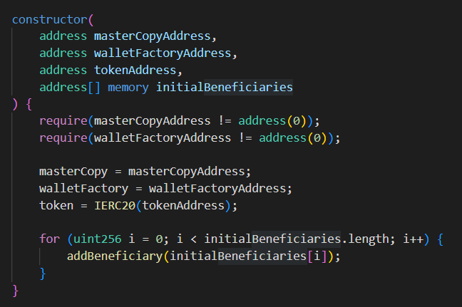
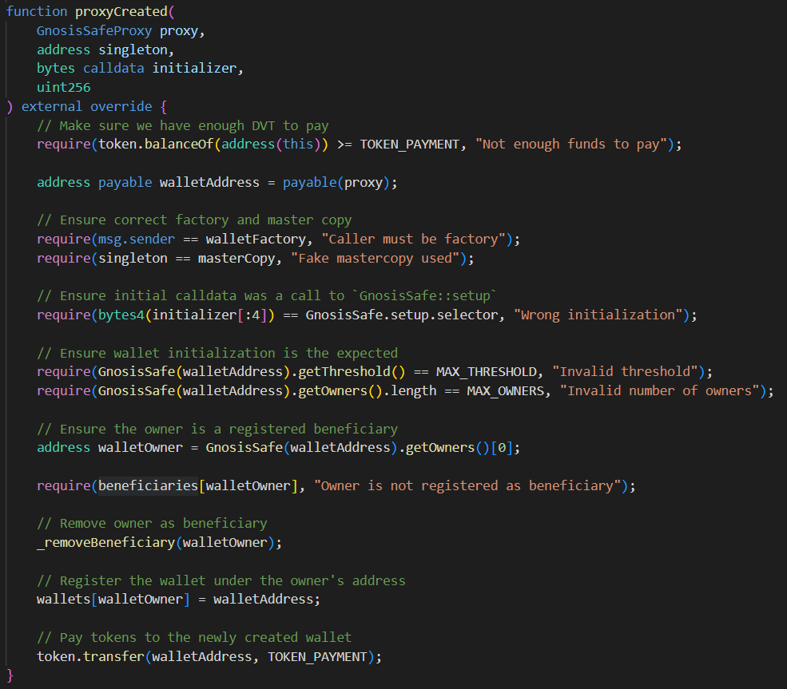
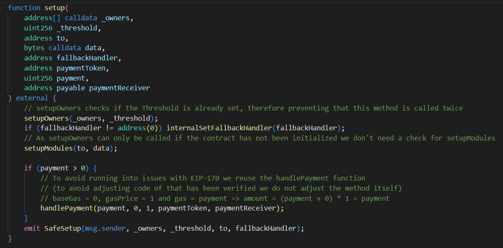
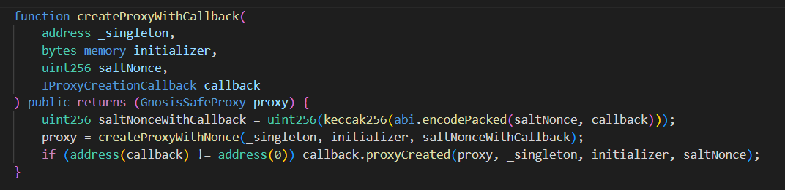
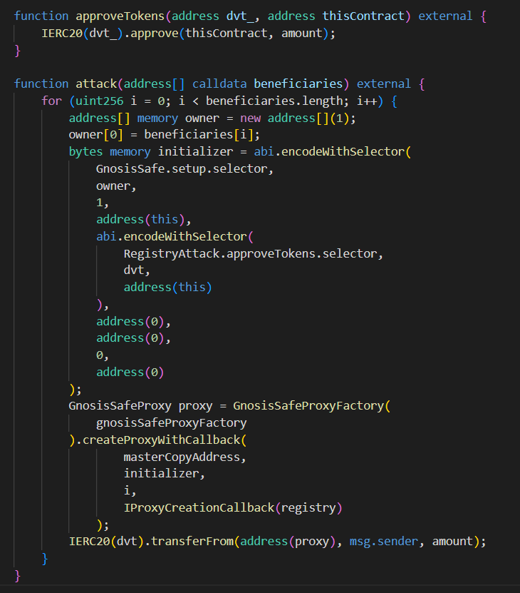
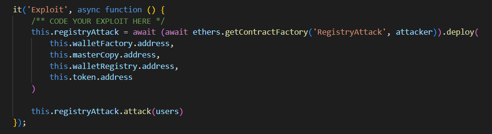

# Backdoor

## Challenge description
To incentivize the creation of more secure wallets in their team, someone has deployed a registry of Gnosis Safe wallets. When someone in the team deploys and registers a wallet, they will earn 10 DVT tokens.

To make sure everything is safe and sound, the registry tightly integrates with the legitimate Gnosis Safe Proxy Factory, and has some additional safety checks.

Currently there are four people registered as beneficiaries: Alice, Bob, Charlie and David. The registry has 40 DVT tokens in balance to be distributed among them.

Your goal is to take all funds from the registry. In a single transaction. 

## Contracts

We are given one contract named `WalletRegistry`. On it there are the wallet factory initialized and beneficiaries initialized in the form of a `mapping`.

`proxyCreated()` is a callback function executed when user creates a Gnosis Safe wallet via `GnosisSafeProxyFactory::createProxyWithCallback` setting the registry's address as the callback.

It has a bunch of `require()` statments to prevent maliciousness. In the end it transfers the amount to the beneficiaries after the wallet creation forming an incentive.

Also we need the knowledge of `GnosisSafe` contracts to successfully detect the vulnerability. The gnosis factory smart contract deploys wallets (smart contracts) for us to use. It uses a proxy in the process of creation.

The `setup()` function on our wallet does basicly what it says. It setups many data necessary for proper functioning of the wallet such as owners etc. 

The `createProxyWithCallback()` function will create our wallet and one of the parameters is the callback function to call which in our case is called `proxyCreated()` and is located on the `WalletRegistry`.

## Vulnerability

By examining the `setup()` function we can see that it accepts a `to` and a `data` parameter and both are used in `ModuleManager`’s `setupModules()` function through the `Executor` contract’s `executor()` function to delegateCall into to with the data as a payload.
Now, this could be used as a backdoor.

## Attack

Since the DVT tokens will be transferred to the proxy’s address by the `WalletRegistry` all we have to do is ask the proxy to approve all the tokens for ourselves.
The solution is the following:
1. Create a function that will be used to approve tokens to a spender and will be called by the proxy
2. Create an encoded payload from this approve function.
3. Create the encoded initializer payload from the GnosisSafe’s `setup()` function passing the attacker contract’s address as to and the encoded approve function as the data
4. Execute the `createProxyWithCallback()` function for each user with this initializer
5. Transfer the approved tokens to the attacker’s address.

Here's the contract.

In the .js script we just deploy and call the `attack()` function.

## TLDR

By exploiting the gnosis factory wallet creation modules, we are able to drain funds meant for other wallets to collect.