# Climber

## Challenge description
There's a secure vault contract guarding 10 million DVT tokens. The vault is upgradeable, following the UUPS pattern.

The owner of the vault, currently a timelock contract, can withdraw a very limited amount of tokens every 15 days.

On the vault there's an additional role with powers to sweep all tokens in case of an emergency.

On the timelock, only an account with a "Proposer" role can schedule actions that can be executed 1 hour later.

Your goal is to empty the vault. 

## Contracts
On the `ClimberVault` contract there is an `initialize` function that will be called first and only once. Since we are using an upgradeable contract, we cannot use a constructor because if we deploy a contract behind a proxy it is completely oblivious to the [constructor](https://docs.openzeppelin.com/upgrades-plugins/1.x/proxies#the-constructor-caveat). 

In the Vault we initialize some state variables and transfer the Vault ownership to a new contract, the `ClimberTimelock` contract.

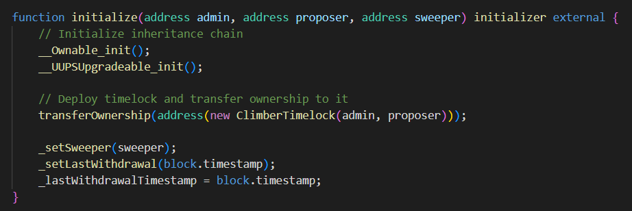

There is a function in the contract that looks very tempting to us since its' the function you would invoke to sweep all funds from the contract. Unfortunately, its' invoking is restricted to the `Sweeper` role. It would be nice to get it.

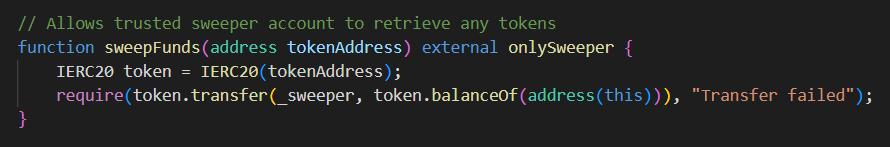

And because this contract is upgradeable, meaning it is called behind a [proxy](https://docs.openzeppelin.com/contracts/4.x/api/proxy). This contract can only be upgraded by the owner, which is the `Timelock` contract.

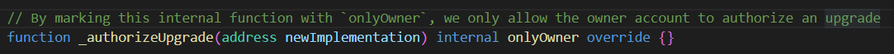

The `ClimberTimelock` contract which is deployed by the `Vault` contract and is its' owner consists of several parts. In the constructor there is a role managment system initialized. Also, something to note: the contract itself is its' own admin!

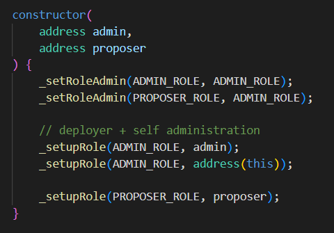

Every operation to be executed by this contract first has to be scheduled on the contract and then a certain amount of time has to pass before it's executed. There is a lucrative function on the contract to change the delay.

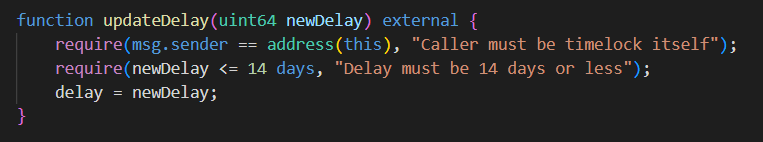

There is a `schedule` function where we schedule operations to be executed (only by the `PROPOSER_ROLE`)...

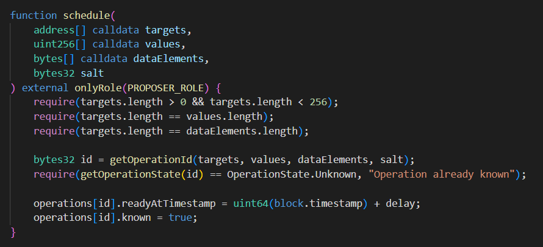

by calling the `execute` function.

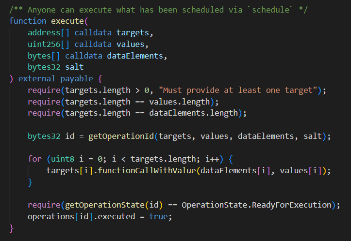

## Vulnerability
We notice on the execute function, beyond the various checks on it there is a check to verify the operation is `ReadyForExecution`. That basicly checks that enough time has passed between scheduling and executing the function.

The main vulnerability on these contracts is that the check for valid function calls is executed after the calls. Our plan is to execute a bunch of operations, one of which is setting those operations as `ReadyForExecution`. Then the checks that perform after the call will be valid.

## Attack
We've detected the main weekness on the Timelock contract. Now it's just about listing the things we have to execute to drain the funds off of the Vault.

1. Update the delay to zero (0).
2. Grant us the `PROPOSER_ROLE` so we can schedule these malicious actions.
3. Transfer the ownership of the Vault contract from the Timelock contract to us.
4. Schedule these actions with the `schedule` so the last check on `execute` passes.

We define these function calls on our own contract we've named `ClimberAttack`.

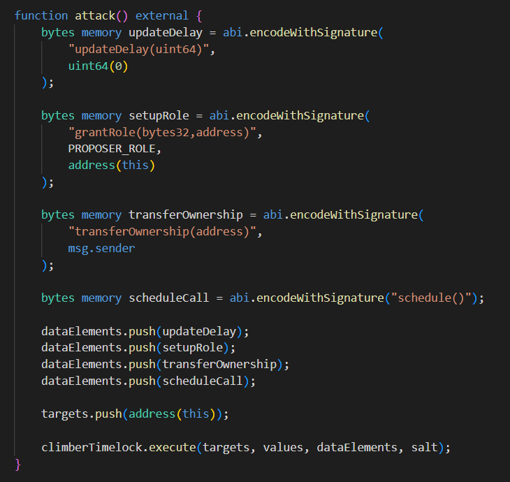¸

There are two things to note:

- First one is that Timelock is its' own admin so we can execute these operations since the `msg.sender` is the Timelock contract.
- Second thing to notice is that we can't schedule these operations directly by calling it through the `execute` function since we would fall into a recursive loop. So we write on our own `schedule` function that will be invoked and do the dirty work for us.
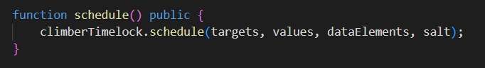

Once we have full ownership of the Vault contract we still can't sweep funds because we don't have a `SWEEPER_ROLE`. Our only way to sweep the funds is to change the very way the Vault contract works! 

That can be done by upgrading the contract. 

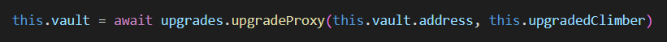

Since we are the owners we can do that. We write the new contract to easily sweep funds. Our upgrade contract has to follow various storage compatibility patterns so it can work properly and ultimately be upgraded.

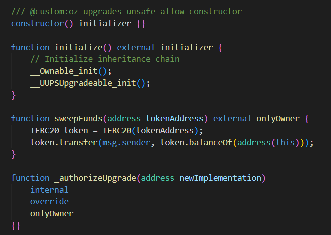

One function call (`sweepFunds`) and we have it!

## TLDR
By detecting a vulnerability in the `ClimberTimelock` contract we are able to upgrade the `ClimberVault` to something a little bit more to our own liking, something suitable for draining the entire vault.

