# Compromised

## Challenge description
While poking around a web service of one of the most popular DeFi projects in the space, you get a somewhat strange response from their server. This is a snippet:

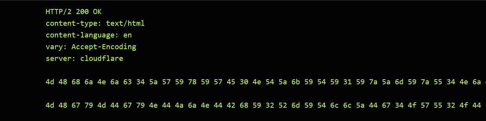
A related on-chain exchange is selling (absurdly overpriced) collectibles called "DVNFT", now at 999 ETH each

This price is fetched from an on-chain oracle, and is based on three trusted reporters: 0xA73209FB1a42495120166736362A1DfA9F95A105, 0xe92401A4d3af5E446d93D11EEc806b1462b39D15 and 0x81A5D6E50C214044bE44cA0CB057fe119097850c.

Starting with only 0.1 ETH in balance, you must steal all ETH available in the exchange.

## Contracts

There is a `TrustfulOracleInitializer` contract that just initializes and creates a `TrustfulOracle` that takes in reliable off-chain sources to provide us with the current prices of the NFTs. As well as sources, the oracle is provided with the NFTs symbols and initial prices.

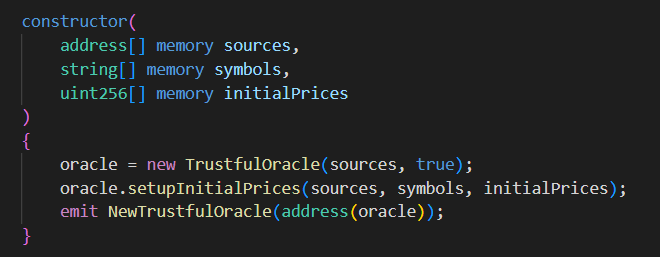

In the constructor of `TrustfulOracle` we setup roles for the reliable sources provided to us by the `TrustfulOracleInitializer`. Also the contract is granted the `INITIALIZER ROLE`.

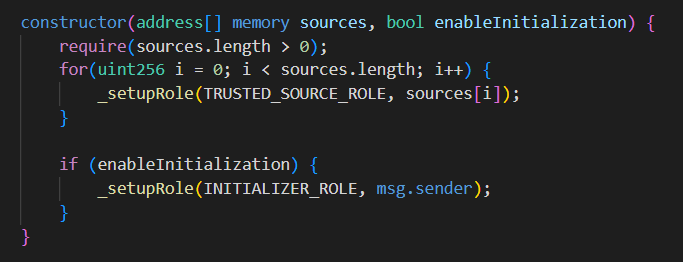

The function most interesting from an attackers' perspective is `postPrice()` because it changes the price of the NFT on the contract. We see an opportunity here. Abuse this function to change the price to cheap then buy it. After that change the price to something abnormally expensive and then sell it. It can only be called by an account with the role of `TRUSTED_SOURCE_ROLE`. 

It invokes `_setPrice()`.

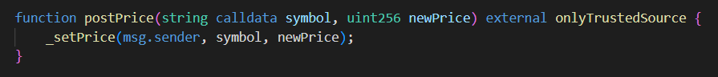

The `_setPrice()` method sets the price of the NFT of the chosen NFT to the parameter `newPrice` sent to it.

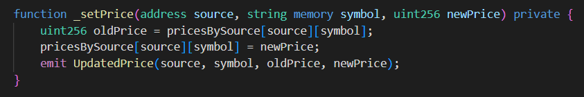

The price of NFT when selling or buying is not its' listed price but the median price of all NFTs on sale. This means we can rig the prices of only two (2) NFTs (there are three (3) currently on sale) and we'll be able to buy one (1) cheap.

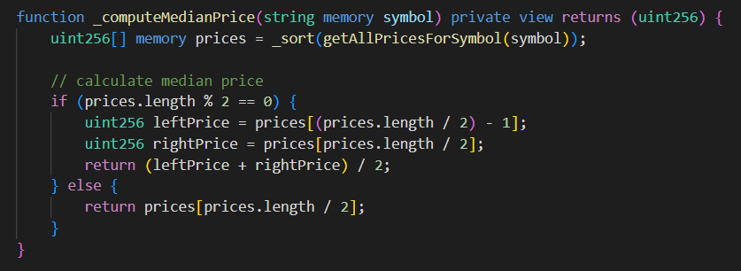

Also there are a bunch of getter functions on the contract we will use. We don't have to get into them because their use-case is pretty obvious.

On the `Exchange` contract there are two (2) very basic functions typical for an exchange. The buy and the sell function. We are only able to buy and sell one (1) NFT at a time.

Functions written on the contract are self-explanatory. 

When you buy an NFT you pay the current median price fetched from the `TrustedOracle` contract.

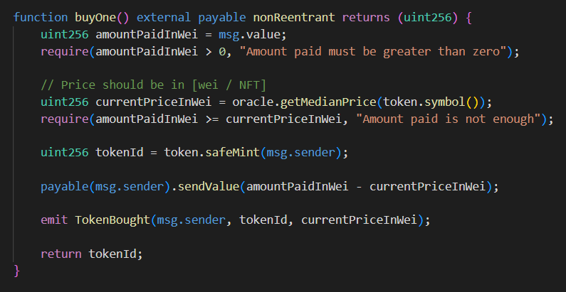

When you sell an NFT you are sent the current median price fetched from the `TrustedOracle` contract.

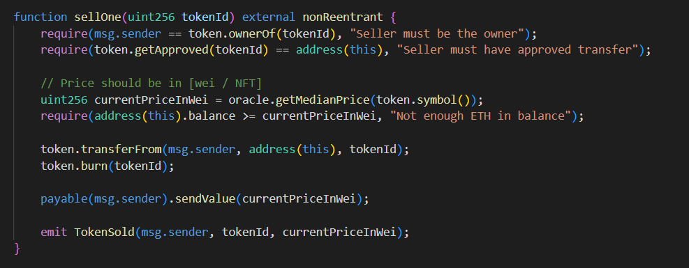

## Vulnerability

The vulnerability on this exchange system is based on the oracle price computation and the server error we discover in the beginning of the challenge.

Because the price is calculated based on the prices fetched from the oracle contract, our first thought is to somehow change the prices on the oracle. Sadly, changing prices is reserved only for users with the `TRUSTED_SOURCE_ROLE`.

Luckily, we received a somewhat strange response from the server.

The title of the challenge gives us a hint: compromised. What is the most valuable thing that if compromised all of our assets are at risk in the blockchain world? That’s right - the private keys. The leaked data looks like bytes in hexadecimal format.

We used an online tool like `cryptii` to decipher these bytes to a format that looks like a private key. When we create Wallet-type accounts using the ethers library we see we got the addresses of two (2) trusted sources. Great.

## Attack

The attack consists of maneuvering the price in our benefit. Before this we create wallet instances with the private keys we've discovered. Using those wallets we alter the prices.

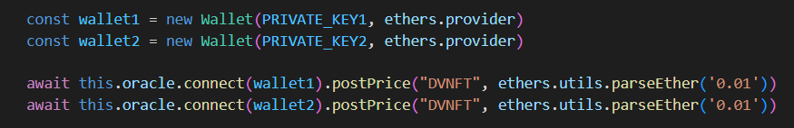

Thanks to the price mechanism scheme which looks at the median price of all NFTs listed we can buy one token by the price of point zero one (0.01) ether which is a tenth of our balance. The price is voluntarily set.

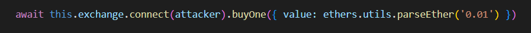

Then we just `postPrice()` of the remaining NFTs to the balance of the exchange to allow us to sell it at the maximum price. After that we sell it.

At the end, since in the after clause of this attack the price has to be the same as the initial one, we set it to `999` (`INITIAL_NFT_PRICE`).

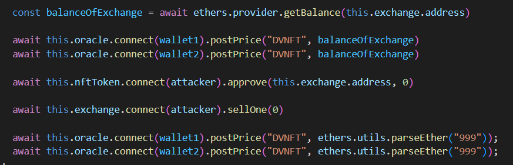

## TLDR
By discovering some private keys because of a server error, we are able to rig the prices of some NFTs on-chain. Then we buy them cheap and sell them high!
