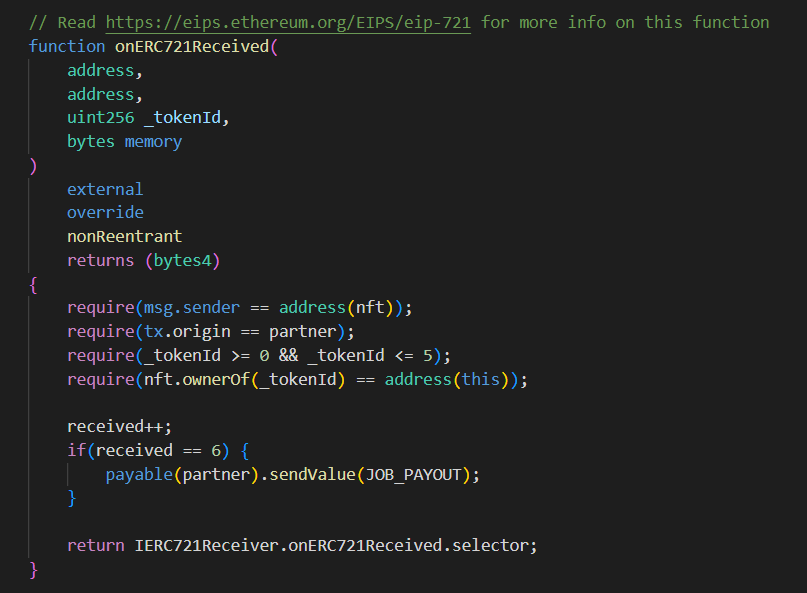
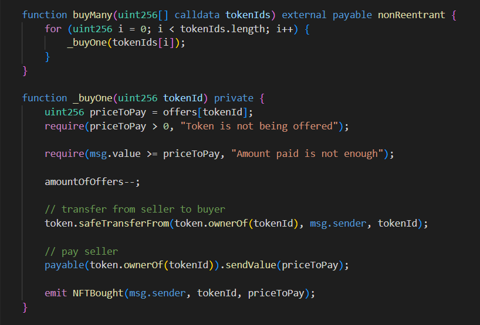
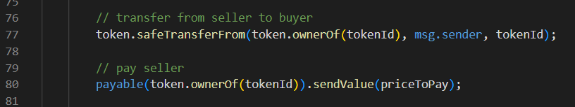
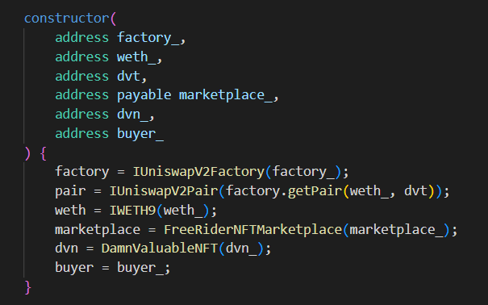
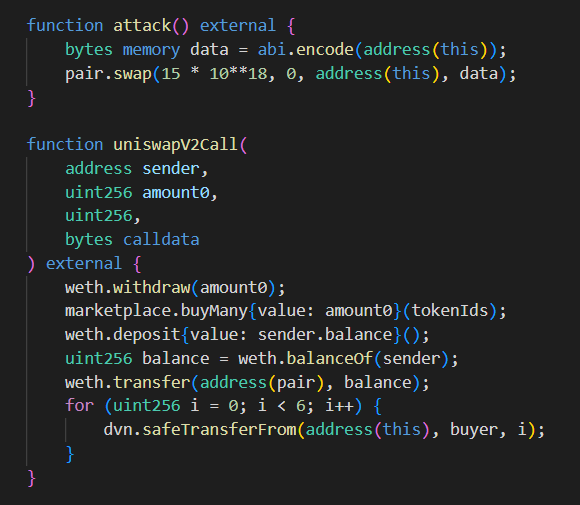

# Free rider

## Challenge description
A new marketplace of Damn Valuable NFTs has been released! There's been an initial mint of 6 NFTs, which are available for sale in the marketplace. Each one at 15 ETH.

A buyer has shared with you a secret alpha: the marketplace is vulnerable and all tokens can be taken. Yet the buyer doesn't know how to do it. So it's offering a payout of 45 ETH for whoever is willing to take the NFTs out and send them their way.

You want to build some rep with this buyer, so you've agreed with the plan.

Sadly you only have 0.5 ETH in balance. If only there was a place where you could get free ETH, at least for an instant. 
## Contracts
We have been given two (2) contracts in the `contracts/free-rider` repo. `FreeRiderBuyer` and `FreeRiderNFTMarketplace`. 

`FreeRiderBuyer` is a contract that promises us our payout if we successfully retrieve NFTs from the marketplace contract. Every time it receives an NFT the `onERC721Received()` function is called. It keeps track of NFTs it has received and basicly makes sure we fulfilled our end of the agreement and then it pays us.

The `Marketplace` contract has two parts:
* Offering for sale
* Buying listed items

We will focus on buying since the listing has been done for us in the setup and we can't use it in the attack.

## Vulnerability
Vulnerability found in this example is located on the `FreeRiderNFTMarketplace` contract.

On line 77 the contract is transferring the NFT token to the buyer.

On line 80 it is transferring funds to the owner.

These mismanaged lines of code display a huge vulnerability. Since we transferred the ownership to the buyer, the contract will send funds to the same buyer.

If only we've put the line on line 80 above the code on line 77 this never would have happened!
## Attack
In order to execute the attack in one transaction, we're going to deploy our own `Attacker` contract and write an attack function that is going to buy six (6) NFTs on the marketplace.

Since we do not hold the funds necessary to buy the NFTs (we still have to send the asked price in Ether in order to pass some conditions on the contract) we will make use of __Flash Loans__. 

A great feature of UniswapV2 protocol that will enable us to borrow an amount of WETH is called __flash loan__. 

We borrow funds from the UniswapV2 liquidity pool we would otherwise use for trading. But this time we don't trade anything. We just borrow an asset.

Basicly we can dispose with the funds before the end of the transaction with the sole condition we transfer the borrowed funds back by the end of the transaction. That is the way we'll have enough Ether to cover 'buying' NFTs.

We start by initializing the `Attacker` contract with the necessary parameters. We'll use the UniswapV2 pair contract for borrowing funds and `WETH9` contract for depositing Ether in exchange for WETH tokens.

Next we `attack` the marketplace. We start by 'borrowing' 15 WETH from the UniswapV2 liquidity pool. When you pass `bytes data` as the last parameter in the `swap()` function call on the UniswapV2 contract it means we are performing a flash loan.

The UniswapV2 contract will call our `uniswapV2Call()` function as a callback and in the function we are ready to use this amount0 amount of WETH tokens, under the condition we transfer it back at the end. So in here we just buy up all the NFTs one by one. Since the amount will be transfered back to us by the end of the `Marketplace` buying we can just buy them one by one.

Then we transfer them to the `FreeRiderBuyer` contract. Next we receive the payout as is written in the contract. Our `after()`
conditions are met :)
## Summary
We've successfully 'stolen' all NFTs on the marketplace because of faulty order of code written on it. It first transferred ownership and then transferred the funds to the __NEW__ owner.

