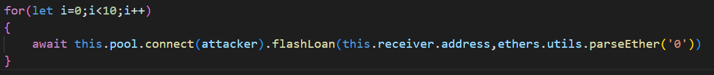
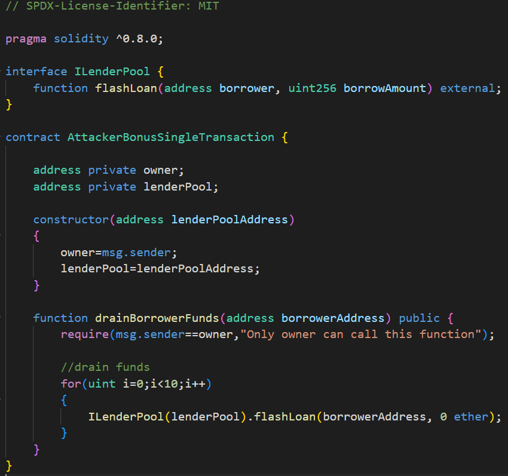

# Naive receiver
# Description
 There's a lending pool offering quite expensive flash loans of Ether, which has 1000 ETH in balance.

You also see that a user has deployed a contract with 10 ETH in balance, capable of interacting with the lending pool and receiveing flash loans of ETH.

**Drain all ETH funds from the user's contract.** 

***Doing it in a single transaction is a big plus ;)***
# Contracts
- `FlashLoanReceiver.sol`: users contract which interacts with the lending pool contract. Main method is `receiveEther()` which is called from `NaiveReceiverLenderPool.sol` as part of borrower method invocation during flash loan procedure. Inside this method we calculate amount of ETHs we need to repay and check if we can handle it. If we have enough ETHs to repay, empty `_executeActionDuringFlashLoan() internal` method is invoked and flash loan is repaid. You have probably noticed `payable` keyword in `receiveEther()` and `receive()` method definitions. Also, `receive()` method is defined but doesn't have any procedures defined inside its body. Reason for using these new concepts is because we are now dealing with ETH which is native blockchain cryptocurrency(not **token** like previous cases) and Solidity is designed to support native blockchain cryptocurrency it provides us with special native methods, keywords and syntax which we need to follow in order to work with ETH transfers. For the purpose of our attack we will explain these 2 important parts:
    - `payable`: keyword which must be specified in definition of every method which receives ETH via native `send()` and `transfer()` methods. Also, in order to call `send()` and `transfer()` methods on address, address also must be defined as `payable`. 
    - You could ask yourself: *What happens if someone sends ETH to our contract? Is it added automatically to its balance or we need to implement some receive mechanism?* Solidity is very concise about this problem and it defines strict guidances which our contract needs to follow in order to receive ETH. When someone sends ETH to our contract, transfer mechanism first checks if contract has `receive() external payable` method defined. If that is the case, ETHs are added to contract balance and inside body of `receive()` method we can define custom actions which we want to execute uppon receival. If `receive() external payable` method doesn't exist mechanism checks if `fallback() external payable` method exists. If this method also doesn't exist transfer is reverted and exception is thrown.
        >**Note**: Contract can define only one `receive()` and only one `fallback()` method.
- `NaiveReceiverLenderPool.sol`: contract which provides expensive ETH flash loans through `flashLoan()` method with fee set to 1 ETH. Notice that `flashLoan()` method doesn't necessarily need to be invoked by contract since the borrower method isn't restricted to be called on `msg.sender` address. In other words, any EOA or contract can invoke `flashLoan()` method and specify address of target contract in `borrower` parameter as long as target contract has `receiveEther()` method implemented wich follows the same signature as specified inside Solidity's `abi.encodeWithSignature()` method. Notice that `receiveEther()` method is called using helper `functionCallWithValue()` method from **OpenZeppelin** [address](https://docs.openzeppelin.com/contracts/3.x/api/utils#Address-functionCallWithValue-address-bytes-uint256-) utility which enables us to send ETHs to invoked function which of course must be `payable`. Fee value is fetched using `fixedFee()` method which is declared with Solidity's `pure` keyword which means that method invocation doesn't change state of contract i.e. doesn't spend any gas fee. There is also a `receive()` method which is necessary in order to receive ETHs when borrower repais the flash loan. 
    >**Note**: ABI stands for **A**pplication **B**inary **I**nterface and represents a standardized way for interacting with contract methods.
- `AttackerBonusSingleTransaction.sol`: contract with single `drainBorrowerFunds()` method used to achieve bonus points by performing attack inside single transaction. If you ask yourself why do we need to define contract in order to perform attack inside single transaction wait until we reach [bonus](##Bonus) chapter or if you are really curios and can't wait feel free to check it now.

# Vulnerability
Enabling flash loan borrower to specify any contract address on which target method will be invoked is really unusual and suspicious at first glance. Knowing that a flash loan is designed to be a 2 party procedure we notice that in our current case flash loan can include 3 parties - `flashLoan()` method invocator, contract specified inside `borrower` parameter and lending pool contract. In other words, some 3rd EOA/contract can borrow flash loan on behalf of other contract **without its approval**. Using this vulnerability we can request `flashLoan()` on behalf of users contract and succeed in our mission.
# Attack
*How can we utilize possiblity to invoke `flashLoan()` method on behalf of users `FlashLoanReceiver.sol` contract to drain all of its ETHs?* Every time flash loan is requested fee of 1 ETH must be added on top of borrowed amount and repaid to lender pool contract. Entity who will pay this 1 ETH is not us, but users `FlashLoanReceiver.sol` contract. Thus, for every incovation of `flashLoan()` method 1 ETH will be deducted from users `FlashLoanReceiver.sol` contract balance since contract first receives borrowed amount of ETHs and then repais that same amount increased by 1 ETH. If we invoke `flashLoan()` method **10** times, all 10 ETHs from `FlashLoanReceiver.sol` balance will be deducted and contract balance will be drained. Before implementation we should consider next question: *Is `borrowAmount` parameter relevant for our attack i.e. do we need to put some specific value or we can put arbitrary one?* As we mentioned before, `FlashLoanReceiver.sol` contract receives borrowed amount of ETHs and **„repais that same amount increased by 1 ETH.“** As long as our `borrowAmount` is less or equal than pool balance we can specify arbitrary value. 
## Basic
Probably first idea for implementation of previously specified attack plan is to use `for` loop, iterate 10 times and each time invoke `flashLoan()` method on `NaiveReceiverLenderPool.sol` contract with `borrower` set to users `FlashLoanReceiver.sol` contract and `borrowAmount` to arbitrary value less or equal than lender pool balance. To ensure this condition in every state of `NaiveReceiverLenderPool.sol`contract we initialize it to 0 since `flashLoan()` method doesn't check if `borrowAmount` is greater than zero. Implementation of JavaScript code for this basic approach is given on next image:

## Bonus
We could ask ourselves: *Why would we want to enhance previous basic procedure? Is it beacuse of less processing power or something else?* Nowadays, processing power is usually not a bottleneck especially when dealing with 10 iterations. Answer lays in number of transactions required to perform basic approach and associated gas fees required for each transaction. Since Ethereum is one of the most popular blockchains and number of transactions which can be processed and stored inside one block is fixed corresponding gas fees are very hight especially if we want to execute our transactions soon. Basic approach includes 10 blockchain transactions which is not a small number considering current network congestion. In order to perform attack in single transaction we must create and deploy smart contract with a single method which will also loop 10 times and in each iteration invoke `flashLoan()` method. If you ask yourself why is this different than basic approach wait for a sec to expand your blockchain knowledge. If you already know the answer than kudos to you. To understand the difference we need to define **regular transactions** and **internal transactions**. Regular transaction are the ones that you thought about so far when talking about transactions. They are stored on blockchain forever and can be examined by anyone. Important think about regular transactions is that they are cryptographically **signed** by private key. Thus, they can **only be called by EOA** who has definec private key. Because of this, smart contracts can't be self executed since they require EOA initiator/invokator of contract method in order to sign a transaction. This is what we perform inside our JavaScript code. Any method invocation by `ethers.getSigners()` instance is a transaction which is signed by speficied instance. If we examine flash loan concept which we have learned, we notice that after `ethers.getSigners()` invokes contract method several contract interactions and method invocations take place. These interactions between smart contracts are what we call internal transactions. We conclude that internal transactions must be preceded by main regular transaction and that they are **not signed** since contract is not an EOA i.e. doesn't have a private key. Since one regular transaction can result in thousands of internal transactions they are stored off-chain otherwise blockhain size would be enormous and network congestion would be unbearable. In our case, invokation of `drainBorrowerFunds()` method on our `AttackerBonusSingleTransaction.sol` contract will be a regular transaction, and `flashLoan()` method invokations inside loop together with other method invokations followed up by this call and which are result of contract interaction will be regular transactions. `AttackerBonusSingleTransaction.sol` contract code can be viewed on next image:

# Summary
## Basic
- Create transaction by invoking `flashLoan()` method on lender pool contract with specified `borrower` value to user contract and `borrowAmount` to 0
- `flashLoan()` method invokes `receiveEther()` method on user contract which repais borrowed amount + 1 ETH fee - 1 ETH is deducted from user contract balance
- Repeat same procedure 9 more times
## Bonus
- Deploy contract
- Inside single transaction:
    1) Invoke `flashLoan()` method on lender pool contract with specified `borrower` value to user contract and `borrowAmount` to 0
    2) `flashLoan()` method invokes `receiveEther()` method on user contract which repais borrowed amount + 1 ETH fee - 1 ETH is deducted from user contract balance
    3) Repeat same procedure 9 more times
