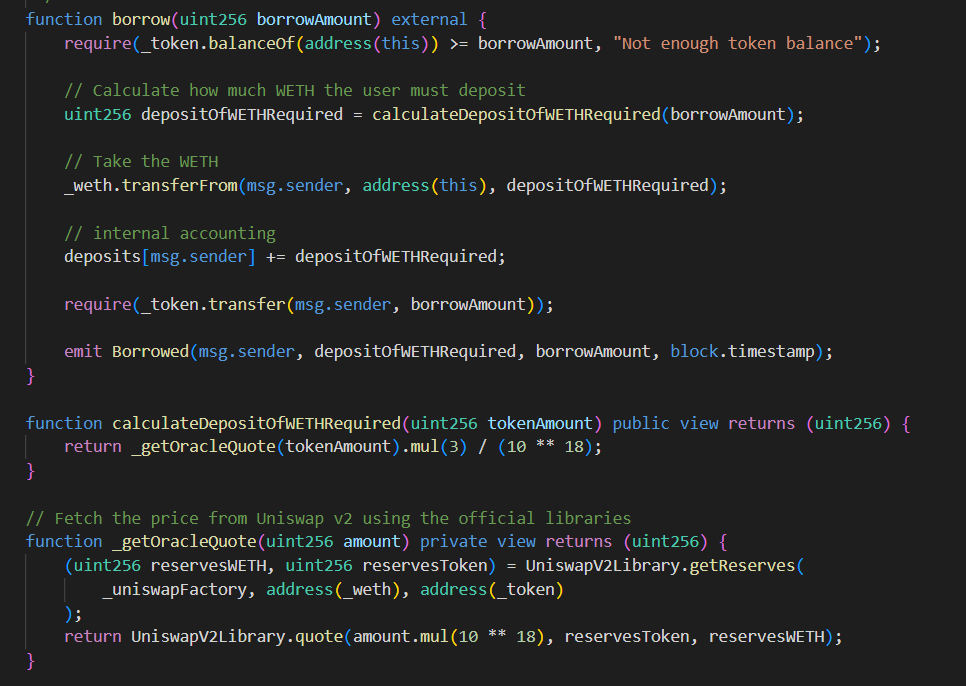
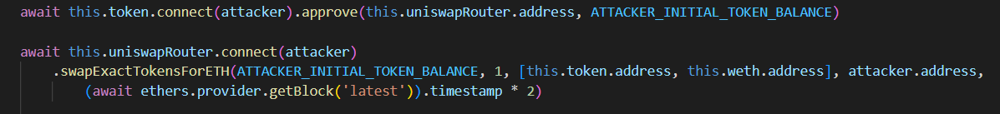
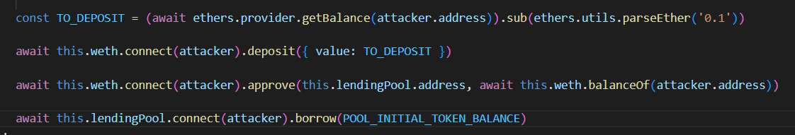

# Puppet v2

## Challenge description
The developers of the last lending pool are saying that they've learned the lesson. And just released a new version!

Now they're using a Uniswap v2 exchange as a price oracle, along with the recommended utility libraries. That should be enough.

You start with 20 ETH and 10000 DVT tokens in balance. The new lending pool has a million DVT tokens in balance. You know what to do ;) 
## Contracts
In this chanllenge we are given a pretty much similiar setup as we are in the previous (__Puppet__) challenge.

There is a `PuppetV2Pool.sol` contract that serves as a lending pool and an UniswapV2 liquidity pool we will use for trading the WETH/DVT pair.

One thing to notice is UniswapV2 protocol uses WETH (as opposed to ETH in the previous version) as a token to trade against. WETH stands for Wrapped Ether meaning it's tokenized for the purpose of easier trading on the protocol. Look for the `WETH9.sol` contract in the `contracts/` directory.
## Vulnerability
Vulnerabilities in this challenge are easy to spot since they're similiar to the last challenge. The lending pool uses the UniswapV2 contract to fetch its' current lending terms.

This should be enough to empty the pool.

## Attack
Since our goal is to lower the price of DVTs on the UniswapV2 contract we must sell our DVTs to lower the WETH/DVT ratio to a minimum.

This enables us to then borrow DVTs for a bargain price.

Some notes to take away from this challenge are that pools with low liquidity are prone to high price deviation and that when using on-chain data sources you should be very careful because they are also prone to manipulation.

## TLDR
Again we have used the vulnerabilities of on-chain data consumption and low liquidity to manipulate the lending pools' terms on lending.
