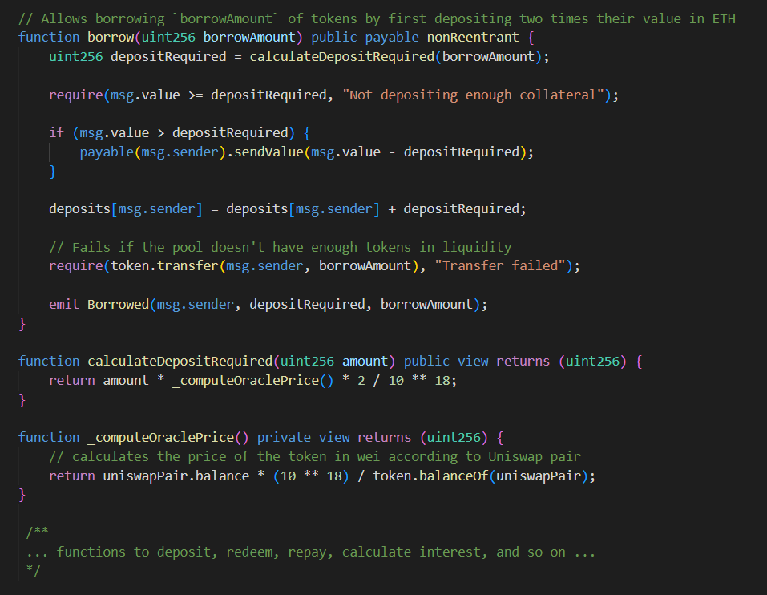
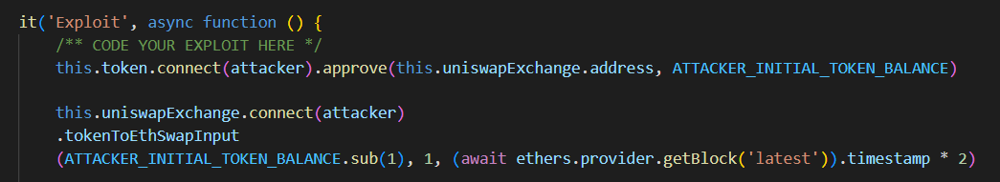
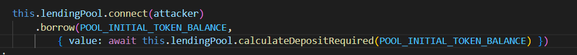

# Puppet
## Challenge description
 There's a huge lending pool borrowing Damn Valuable Tokens (DVTs), where you first need to deposit twice the borrow amount in ETH as collateral. The pool currently has 100000 DVTs in liquidity.

There's a DVT market opened in an Uniswap v1 exchange, currently with 10 ETH and 10 DVT in liquidity.

Starting with 25 ETH and 1000 DVTs in balance, you must steal all tokens from the lending pool. 
## Contracts
Besides the contract given to us in the contracts/puppet directory named `PuppetPool.sol`, an Uniswap V1 liquidity pool is also initialized for us to use. Its' most commonly used for decentralized trading.

In this case the pool consists of ETH/DVT (Ether/Damn Valuable Tokens). The `PuppetPool` contract is used for borrowing DVTs.

Using the `PuppetPool` is fairly simple. We invoke the `borrow()` function with a borrow amount as an argument. In order for our borrowing to work we must send enough __ether__. Amount of __ether__ necessary is calculated on the contract by the `calculateDepositRequired()` function.

The function calculates its' current deposit amount by calling the Uniswap contract as an oracle for fetching the current ETH/DVT price (basicly checking the balance of both pairs on the Uniswap contract).
## Vulnerability
Our first hunch of vulnerability lies in the fact that the `PuppetPool` contract uses another contract to get its' calculations on borrowing terms. This is prone to manipulation.

If we somehow manipulate the balance on the Uniswap contract then we can use that to our benefit.

After careful consideration we come to the realization that simple trading on the Uniswap pool will be enough to lower the price of DVT.

## Attack
Because of the way liquidity pools work, lowering the price of DVT requires selling a portion of those tokens.

We send DVTs in amount of `ATTACKER_INITIAL_TOKEN_BALANCE` and receive the current Uniswap price equivalent of __ether__.

After affecting the price, we see that we can completely drain the `PuppetPool`. By sending 19.7 __ether__ (calculation is done by calling the public `calculateDepositRequired()` function on the `PuppetPool` contract).

Next we simply call the borrow() function with the correct parameters. We request the entire DVT balance of the pool in exchange for sending the calculated amount of __ether__.

This transaction passes and our __after()__ conditions are met. We've drained the pool!

## TLDR
Using the vulnerability of on-chain price calculation we've successfully drained a pool filled with DVTs!