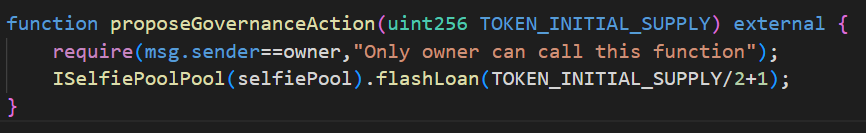
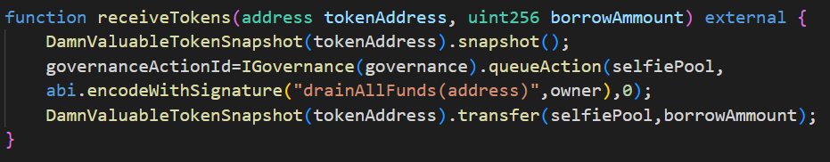
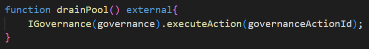

# Selfie
# Description
A new cool lending pool has launched! It's now offering flash loans of DVT tokens.

Wow, and it even includes a really fancy governance mechanism to control it.

What could go wrong, right ?

You start with no DVT tokens in balance, and the pool has 1.5 million. Your objective: **take them all**.
# Contracts
- `SelfiePool.sol`: contract which offers flash loans through its `flashLoan()` method. Procedure is similar as in previous attacks. Contract which invokes `flashLoan()` method must implement `receiveTokens()` method following signature specified inside `abi.encodeWithSignature()` which specifies DVT token address as first parameter and borrowed amount as second parameter. Borrower contract method is invoked by `functionCall()` method provided by **OpenZeppelin** address [utility](https://docs.openzeppelin.com/contracts/3.x/api/utils#Address-functionCall-address-bytes-). Significant difference between previous flash loan contracts is in `drainAllFunds()` method. As you can guess from its name, this method enables withdrawal of all funds from the lending pool. Usually we should expect that this method could be invoked only by contract owner, but in this case `onlyGovernance` modifier specifies that `drainAllFunds()` method can be invoked only by the `SimpleGovernance.sol` contract. Also, receiver doesn't need to be `msg.sender` address(or in this case `SimpleGovernance.sol`), but it can be any address specified by `receiver` parameter value.
- `SimpleGovernance.sol`: contract which implements simple DAO governance mechanism. Since we talk about decentralized organization anyone can join and participate in its actions. Participants can propose certain action which they would like to execute by invoking `queueAction()` method. Ofcourse, we can't let anyone propose any action they want and execute it since this would lead to anarchy which is opposite to term *organization*. Thus, we restrict these procedures with `governanceToken` - the more token you have the more power/votes you have. In our case `governanceToken` address is same as `DamnValuableToken` address so they are equivalent. Action proposal is allowed only if participant who proposes it has at least 50% + 1 `governanceToken` in most recent `snapshot` which is ensured by `_hasEnoughVotes()` method. If this condition is satisfied, action is succesfully proposed and added to queue(**it is still not executed**). For every proposed action we specifiy and store properties specified in `GovernanceAction` structure:
    - `receiver`: address of contract on which we will execute our prposed action. Passed as `receiver` parameter inside `queueAction()` method.
    - `data`: represents `bytes` encoded ABI of method which we want to invoke on `receiver` contract. 
    - `weiAmount`: amount of `wei` which will be transferred to `receiver` address during action execution. Since Solidity doesn't suport floating point numbers we cannot specify for example amount of 1.2 ETH. Thus, we work with `wei` units. 1 ETH = 10^18 `wei`
    - `proposedAt`: stores timestamp of block in which action was **proposed** so we can check if delay period between proposal and execution is respected
    - `executedAt`: stores timestamp of block in which action was **executed** in order to prevent multiple executions of same action.

    Since we need to remember our action for later execution we need to save it in our contract memory via `storage` keyword. Also, for every proposed action we generate unique `actionId` as a simple counter increment. `actionId` is returned to participant who proposes action so he can later execute it by providing this identifier. This is enabled by `actions` mapping variable which stores every proposed action in contract memory forever(`storage` keyword).
    
    In order to execute proposed action we need to satisfy conditions specified in `_canBeExecuted()` method i.e. method can't be executed before(`executedAt` property records this) and at least 2 days passed between action proposal and execution.
- `DrainSelfiePool.sol`: attacker contract with 3 specified methods. Details about these methods will be covered in [**Attack**](#Attack) chapter.
# Vulnerability
As we previously mentioned in [THE REWARDER REFERENCIRAJ], token `snapshot` mechanism is used inside DAOs in order to prevent vote manipulation. We mentioned one method of prevention which includes using token balances from X blocks ago(from the time thevoting is proposed) to determine voting power of participants instead of using balances at the time of voting proposal. If we examine `SimpleGovernance.sol` `_hasEnoughVotes()` method we notice that account token balance is read from **last snapshot** of `governanceToken`. `governanceToken` is equivalent to DVT with extended snapshot mechanism specified in `DamnValuableTokenSnapshot.sol` contract. This contract has `snapshot()` method which is wrapper for ERC20 `_snapshot()` method which performs `snapshot` of DVT token at the time it is invoked and identifies it by unique id. Reasons for using this wrapper is because `_snapshot()` is `internal` so we need to expose it to be called ''from outside'' by wrapping it in `public` method and in our contract we want to remember only last token `snapshot`.
By using balances at most recent token `snapshot` while also anyone can perform token `snapshot` we have same problem with vote manipulation as specified in [REWARDER REFERENCIRAJ] attack with only difference that in our case we talk about action proposal and not voting. Thus, if attacker can obtain enough DVTs before action proposal he can succesfully propose an action. Well, at least we are safe in our case since attacker doesn't have any DVTs in balance. ***Are we?*** Checkout it out in [**Attack**](#Attack) chapter.
# Attack
As previously discussed in [**Vulnerability**](#Vulnerability) chapter, DAO governance specified by `SimpleGovernance.sol` contract has a serious flaw in sense of vote manipulations if attacker can obtain enough voting power = `governanceToken` = DVT. *How can we obtain 1 million +1 DVT token in our case starting with 0 DVT?* Answer lays in **flash loan** concept which enables us to borrow certain amount of DVTs, perform certain actions with them and repay them back into flash loan lending pool. In our case, lending pool is `SelfiePool.sol` contract which offers **free** flash loans of DVTs which is great for us since we have 0 DVT on balance. Awesome! Now we have all we need to perform our attack. 
First step is creating and deploying our contract since we need to interact with `SelfiePool.sol` to request flash loan. As specified inside its `flashLoan()` method, our contract must implement `receiveTokens()` method which is invoked after borrowed DVTs are transferred. First we will define `proposeGovernanceAction()` method on our contract which will initiate `flashLoan()` with `borrowAmount` set to `TOKEN_INITIAL_SUPPLY/2+1`.

After we receive borrowed DVTs we want to propose our custom action since we have enough votes for this procedure. But before invoking `queueAction()` on `SimpleGovernance.sol` we perform `snapshot` of DVT token by invoking `snapshot()` method on `DamnValuableTokenSnapshot.sol`. This will record that our balance has amount of DVTs equal to borrowed amount which will then be used by `SimpleGovernance.sol` `_hasEnoughVotes()` method which will confirm that we have enough DVTs to propose. After `snapshot` we are ready to propose our action with `queueAction()` method. *What will be our action?* Remember, we want to take all DVTs from `SelfiePool.sol`. This can be done by invoking its `drainAllFunds()` method which is guarded with `onlyGovernance` `modifier`. But we are not governance?. Indeed we are not, but our proposed action is invoked from `SimpleGovernance.sol` contract. If we remember our `msg.sender` story we conclude that `msg.sender` value will be set to `SimpleGovernance.sol` address resulting in pass of `onlyGovernance` `modifier` condition. So our proposed action will consist of invoking `drainAllFunds()` method on `SelfiePool.sol` contract with `receiver` set to our account address(no need to specify contract address and then transfer DVTs to our account). Since we don't have any ETH on our balance, we set `weiAmount` to 0. After succesfull action proposal we store returned `actionId` in `governanceActionId` variable to enable later action execution and repay flash loan at the end:

Since we need to wait at least 2 days from action proposal to its execution we can not perform our attack inside single transaction. Thus, we define `drainPool()` method on our contract with only purpose to invoke `executeAction()` method with `actionId` prameter set to `governanceActionId` which will then perform our previously proposed action which results in 1.5 million DVTs on our balance:

# Summary
- Deploy contract
- Inside **first** transaction:
    - Request flash loan of `TOKEN_INITIAL_SUPPLY/2+1` DVTs
    - After borrowed tokens receival:
        - Record DVT `snapshot`
        - Propose action which will drain all `SelfiePool.sol` funds
        - Repay flash loan

- Inside **second** transaction:
    - Execute previously proposed action
