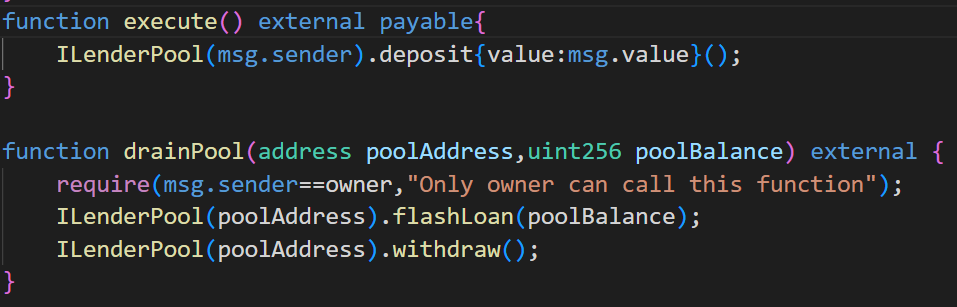
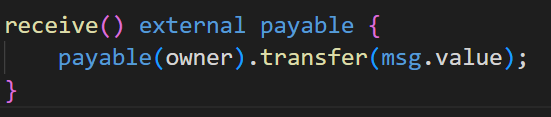

# Side entrance
# Description
 A surprisingly simple lending pool allows anyone to deposit ETH, and withdraw it at any point in time.

This very simple lending pool has 1000 ETH in balance already, and is offering free flash loans using the deposited ETH to promote their system.

**You must take all ETH from the lending pool**. 
# Contracts
- `SideEntranceLenderPool.sol`: contract which implements ETH lending pool which maintains its ETH supply hoping that users will deposit their ETH without getting any interest or reward for it. Deposit is enabled via `deposit()` method and users can withdraw their deposited ETHs at any time by invoking `withdraw()` method. Mechanism used to track balances of users who deposit to pool is implemented using Solidity's `mapping` which mapps depositor address to his amount of deposited ETH. Flah loans are offered via `flashLoan()` method and borrower must be a contract in order to invoke `execute()` method specified in `IFlashLoanEtherReceiver` interface. You have probably noticed `payable` keyword in `execute()` and `deposit()` method definitions. Since we are now dealing with ETH which is native blockchain cryptocurrency(not **token** like previous cases) and Solidity is designed to support native blockchain cryptocurrency it provides us with special native methods, keywords and syntax which we need to follow in order to work with ETH transfers. For the purpose of our attack we will explain 2 important parts:
    - `payable`: keyword which must be specified in definition of every method which receives ETH via native `send()` and `transfer()` methods. Also, in order to call `send()` and `transfer()` methods on address, address also must be defined as `payable`. You could ask yourself: *What happens if someone sends ETH to our contract? Is it added automatically to its balance or we need to implement some receive mechanism?* Solidity is very concise about this problem and it defines strict guidances which our contract needs to follow in order to receive ETH. When someone sends ETH to our contract, transfer mechanism first checks if contract has `receive() external payable` method defined. If that is the case, ETHs are added to contract balance and inside body of `receive()` method we can define custom actions which we want to execute uppon receival. If `receive() external payable` method doesn't exist mechanism checks if `fallback() external payable` method exists. If this method also doesn't exist transfer is reverted and exception is thrown.
        >**Note**: Contract can define only one `receive()` and only one `fallback()` method.
    
    - `execute{value: amount}()`: our contract isn't restricted to receive ETHs only via previously explained `receive()` and `fallback()` methods. We can specify arbitrary `payable` method in which we want to receive ETHs. Solidity supports these cases by providing this special syntax which we need to follow when we want to send ETHs to some custom contract method. Before method invocation parenthesis we list curly brackets with `value` property set to amount of ETHs we want to send.
- `FlashLoanEtherReceiver.sol`: in order to use flash loan concept we have previosuly learned that we need to define and deploy our contract which will implement our logic executed uppon assets receival. `SideEntranceLenderPool.sol` pool specifies signature of method invoked after borrowed ETHs are transferred which we need to follow. This is our `execute()` method. `drainPool()` is our central method which initiates attack. Logic of this method is explained in details in [attack](#Attack) chapter. Since we work wtih ETH transfers and as a part of our attack procedure we also need to define `receive()` method in order to successfully recevied ETHs.

# Vulnerability
Vulnerability of `SideEntranceLenderPool.sol` is in possible discrepancy and inconsistency between despositors balances sum and pool balance which must be same in order to ensure contract integrity. We can cause this discrepancy if we decide to deposit ETHs during flash loan procedure. If we borrow for example 100 ETHs and invoke `deposit()` as our `execute()` method action after `flashLoan()` method is executed we will have 100ETHs at our depositor balance altough we didn't have any ETHs at the beggining. Since we deposited borrowed ETHs to pool it affected its balance which satisfied last `require()` condition. Generaly, pool balance must be equal to sum of depositor balances, but if we perform this check we will notice that sum of depositor balances is greater than pool balance by 100 ETHs which we have previosuly borrowed.
# Attack
Our attack will be focused on causing previously mentioned discrepancy between sum of depositors balances and pool balance. First, we will request flash loan with amount set to pool balance value. We define our `execute() payable` method in which we will deposit all borrowed ETHs into pool. We can access borrowed amount from Solidity's native `msg.value` global variable. 
After we deposited our ETHs, `SideEntranceLenderPool.sol` `flashLoan()` method is succesfully executed and finished. After this, `SideEntranceLenderPool.sol` has recorded inside its `balances` mapping that we have deposited amount of ETHs equal to whole pool balance. Since we "deposited" our ETHs we can then withdraw them anytime we want with `withdraw()` method. Thus, inside `drainPool()` method and after `flashLoan()` is executed we withdraw our funds from pool.

`SideEntranceLenderPool.sol` `withdraw()` method performs withdrawal using **OpenZeppelin** [`sendValue()`](https://docs.openzeppelin.com/contracts/3.x/api/utils#Address-sendValue-address-payable-uint256-) wrapper for native Soldity `transfer()` method sending us our balance amount of ETHs. As we previously explained in [contracts] (#Contracts) chapter, in order to receive these ETHs we must specify `receive() external payable` method on our contract in which we can perform actions using received ETHs. Since withdrawed ETHs are transferred to contract address and we want to transfer them to our/owner address, we perform native Solidity `transfer()` of ETHs from contract to our address and the attack is successfully finished.

# Summary
- Deploy contract
- Inside single transaction:
    1) Borrow ETH amount equal to whole pool balance by invoking pool `flashLoan()` method
    2) As part of flash loan procedure, specify borrower method to perform `deposit()` of all borrowed ETHs back to pool - **discrepancy caused**
    3) After `flashLoan()` execution, withdraw deposited funds from pool
    4) Transfer obtained ETHs from contract address to our address
