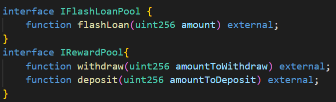
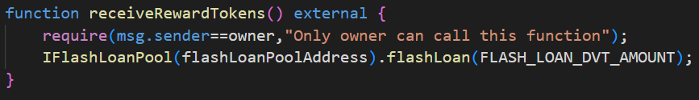
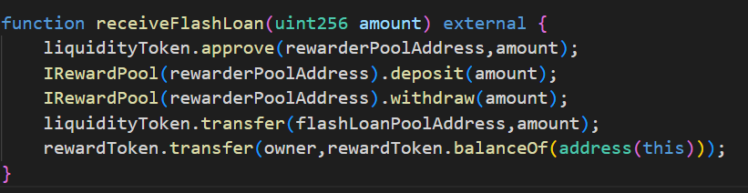

# The rewarder
# Challenge description
 There's a pool offering rewards in tokens every 5 days for those who deposit their DVT tokens into it. 
 
 Alice, Bob, Charlie and David have already deposited some DVT tokens, and have won their rewards!
 
 **You don't have any DVT tokens. But in the upcoming round, you must claim most rewards for yourself.**  
 
 Oh, by the way, rumours say a new pool has just landed on mainnet. Isn't it offering DVT tokens in flash loans? 
# Contracts
- `AccountingToken.sol`: special token type which implements **OpenZeppelin's** [**`ERC20Snapshot`**](https://docs.openzeppelin.com/contracts/3.x/api/token/erc20#ERC20Snapshot)  interface. Snapshot mechanism enables us to capture state of token contract at any time by calling `snapshot()`contract method. This token is used in  `TheRewarderPool.sol` contract to keep track of amount of DVT tokens for each pool depositor(pegged 1:1) by minting/burning. Snapshot is created on start of each reward round and depositors are awarded based on amounts recorded in a given snapshot which are fixed during the reward period.

    >**Note**: Snapshot mechanism is very important in concept of **DAO**(**D**ecentralized **A**utonomus **O**rganizations) to prevent manipulations with voting power. For example, if we use standard ERC20 token iplementation to determine voting power of DAO members based on their balance amounts at the time of voting proposal then members which predict/know/sense that voting will soon take place can increase their voting power by buying ERC20 token before voting procedure and dumping it later. On the other hand, if we use snapshot mechanism and determine members voting power based on their balances recorded in snapshot which was recorded at certain point of time **before** voting proposal, members couldn't manipulate with their voting powers by trading tokens just before voting proposals.

- `FlashLoanerPool.sol`: generous contract which offers flash loans of DVT free of charge to borrower which also must be a contract. After transferring requested amount of DVT tokens it invokes method on borrower contract through `functionCall()` method which is part of **OpenZeppelin's** [**`Address`**](https://docs.openzeppelin.com/contracts/3.x/api/utils#Address-functionCall-address-bytes-) utility interface. At the end it checks if borrowed loan has been repaid. If not, `require` condition will fail and revert all changes which were made in transaction and return reamining gas to loaner. 

- `RewardToken.sol`: token which is issued by `TheRewarderPool.sol` as a reward for depositing DVTs into pool. Every time rewards are issued new reward tokens are minted which increases its total supply.

- `TheRewarderPool.sol`: contract which rewards its depositors by minting certain amount of reward tokens to their addresses. Amount of minted tokens is proportional to their amount of deposited DVT tokens. First reward round starts 5 days since contract deployment. Users can retrieve their rewards for given period either directly by calling `distributeRewards()` method or indirectly by depositing DVT tokens first time in **current** reward round via `deposit()` method which includes amount of deposited tokens into reward amount calculation. Next reward round starts from the moment of first call of `deposit()` or `distributeRewards()` contract methods after previous round was finished. To ensure that user can claim rewards only once during reward period we keep track of last timestamp in which user received reward tokens inside `lastRewardTimestamps` mapping. In order to claim reward, timestamp must be inside current reward period time boundaries.

- `RewardTokenAttacker.sol`: since flash loans from `FlashLoanerPool.sol` contract can be consumed only if loaner is also a contract, we need to define and deploy our own contract in order to succeed in our mission. Contract details are explained in [**Attack**](#Attack) section.
# Vulnerability
There are **2** main parts which enable us to fullfill our goal:

- We notice inside the `TheRewarderPool.sol` contract `deposit()` method that accounting token is minted immediately after we deposit DVTs in pool. If we make a deposit first time in current reward round, our deposited amount of DVT will be included in the calculation of our reward which will be **immediately** transfered to our address. If we deposit large amount of DVT in pool we will also get very large reward in contrast with other depositors who deposit small amounts of DVT compared to ours. Also, we can withdraw our DVTs whenever we want. *But where can we get that large amount of DVT tokens?* Here comes our second part.

- As mentioned before, `FlashLoanerPool.sol` pool is awesome and very generous so we can borrow very large amount of DVTs for free and upon receiving deposit them to `TheRewarderPool.sol` contract which will mint us our reward. After claiming reward we can withdraw our DVTs and payback our flash loan. So we started with nothing and finished with largest reward in current reward round. Pretty cool!
# Attack
Since we need to interact with both `FlashLoanerPool.sol` and `TheRewarderPool.sol` contracts we need to define interfaces for their methods through which we will interact:

After initializing all our dependencies inside `constructor()` call we proceed to define rest of our methods.

We define `receiveRewardTokens()` method which structure must match the structure specified inside `FlashLoanerPool.sol`  `functionCall()` method. This method is starting point of our attack so it must ensure only owner of the contract can invoke it. Through calling `FlashLoanerPool.sol`  `flashLoan()` method it delegates control to our `receiveFlashLoan()` method:

After receiving loaned DVT tokens our goal is to deposit them into `TheRewarderPool.sol` via `deposit()` function to claim our reward and `withdraw()` them  to satisfy `FlashLoanerPool.sol` `require()` condition. We can easily notice these steps inside the `receiveFlashLoan()`method in previously given order, but with added `approve()` function call on DVT token at the beggining. Since our DVT tokens are transferred into `TheRewarderPool.sol` inside its `deposit()` function, spender of our DVT tokens is not our contract which holds these DVTs, but the `TheRewarderPool.sol` contract so we first need to approve them to it in order to transfer our DVTs into pool successfully.

>**Note**: This is part of ERC20 standard specified inside **OpenZeppelin** [`IERC20`](https://docs.openzeppelin.com/contracts/3.x/api/token/erc20#IERC20) interface.
    
After this we have successfully claimed our rewards. Notice that **we** in this case isn't referencing our address but `RewardTokenAttacker.sol` contract address. So final step is draining all claimed reward tokens from contract to address of contract owner which now references **us**

# Summary
- Deploy contract
- Inside single transaction:
    - Using free flash loan borrow DVT tokens
    - Claim reward tokens by depositing borrowed tokens into pool
    - Withdraw deposited tokens immediately after depositing
    - Repay flash loan
    - Transfer received reward tokens from contract to our address
