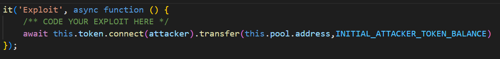

# Unstoppable
# Description
 There's a lending pool with a million DVT tokens in balance, offering flash loans for free. 
 If only there was a way to attack and **stop the pool from offering flash loans** ...
 
 You start with 100 DVT tokens in balance. 
# Contracts
- `ReceiverUnstoppable.sol`: contract which enables its owner to request flash loan from `UnstoppableLender.sol` contract by calling `executeFlashLoan()` method. As part of flash loan concept it also has `receiveTokens()` method which is invoked by loaner contract after loaned tokens are transferred.
    >**Note**: Flash loan is a new DeFi concept brought by smart contracts which enables users with deployed smart contracts to borrow requested amount of token/cryptocurrency without guaranteeing by some collateral(e.g. mortgage in classic loans). Users can use these assets to perform certain operations which they encode in their smart contract function which is called by flash loan contract after borrowed assets are transferred. Users aim is to generate amount which is greater than the borrowed one. After users method is invoked, flash loan checks if borrowed ammount(+ fee if specified) is repaid - if that is not a case than all changes made inside transaction will be reverted.
- `UnstoppableLender.sol`: contract which provides flash loans to users. In order to provide flash loans contract must have certain amount of given asset in its pool. Since contract is alaways deployed by EOA(externally owned account) who signs deployment transaction, it doesn't have any assets in its pool after deploying. So it must enable EOAs or other smart contracts to deposit assets in its pool. This is done by `depositTokens()` method which enables anyone to deposit DVTs in `UnstoppableLender.sol` pool. Using `flashLoan()` method any contract which implements `receiveTokens()` method specified in `IReceiver` interface can borrow certain amount of DVTs if pool amount is greater or equal to requested amount.
    >**Note**: You have probably noticed `transferFrom()` method inside `depositTokens()` which is invoked on DVT contract. This is the right place to introduce and explain 3 methods with very similar names but reasonably different functionalities:
    > - **Solidity** `transfer()`: As a programming language for smart contract implementation Solidity provides its native `transfer()` method which enables transferring certain amount of native blockchain crpytocurrency(**not token**) from one address to another. On Ethereum blockchain we talk about Ether(ETH). Sender address is implicitly determined by Solidity's `msg.sender` global variable.
    > - **ERC20** `transfer()`: method which is part of ERC20 [standard](https://ethereum.org/en/developers/docs/standards/tokens/erc-20/) that introduced tokens. Without going futher inside token definition we can simply define it as a smart contract which hold mappings between owners addresses and balances and provides us with some cool functions specified in ERC20 standard. This method is alawys called on smart contract address of ERC20 token and similar to Solidity's **native** `transfer()` it enables transfer of certain amount of **token** on which contract the method is invoked from one address to another. Also, sender address is implicitly set on `msg.sender` value.
    > - **ERC20** `transferFrom()`: same as previously mentioned `transfer()` method, this method is also part of ERC20 standard. Difference compared to `transfer()` method is in number of parameters which are listed [here](https://docs.openzeppelin.com/contracts/2.x/api/token/erc20#ERC20-transferFrom-address-address-uint256-). In this case we need to set token spender address which is the address of contract/EOA that is spending our tokens on our behalf. In order for someone to spend certain amount of our tokens on our behalf, just like in real world, we first need to approve him to execute this action. This is the role of `approve()` [method](https://docs.openzeppelin.com/contracts/2.x/api/token/erc20#ERC20-approve-address-uint256-) which is also part of ERC20 standard and must be invoked before `transferFrom()` method. We conclude that main difference between ERC20 `tansfer()` and `transferFrom()` method is that in case of `transfer()` method action we include 2 parties - `sender` who sends `amount` tokens to `receiver`, and in `transferFrom()` we include 3 parties - `owner` of tokens who approves `spender` to spend `amount` of tokens on his behalf which he can send to any number of `receiver` addresses until total spent amount is less than approved `amount`.

# Vulnerability
In order to prevent pool from offering flash loans we conclude that we need to examine `flashLoan()` method to determine contract vulnerability. Stopping pool from offering flash loans suggests that we target conditions inside method which need to be satisfied for its successful execution. These conditions are specified with Solditiy's `require()` and `assert()` methods(more about their difference [here](https://codeforgeek.com/assert-vs-require-in-solidity/)). `borrowAmount` parameter is specified by `flashLoan()` method invocation so we don't control it. Second and last `require()` ensure integrity of flash loan protocol so we can't change them. Only part left is the `assert()` method call. If we ensure difference between values of `poolBalance` and `balanceBefore` variables `flashLoan()` method will revert. Because contract updates `poolBalance` variable only when it receives tokens via `depositTokens()` method it anticipates that users will follow this implicited protocol and only deposit tokens in pool using this method. We are not ordinary users, so if we deposit tokens to pool directly using ERC20 `transfer()` method we will bypass anticipated protocol and cause discrepancy between `poolBalance` and `balanceBefore`, thus stop pool from offering flash loans.
# Attack
By explaining contract vulnerability in [previous chapter](#Vulnerability) we pretty much described our attack procedure. Attack is pretty simple and requires single transaction. It consists of transferring arbitrary amount of DVTs to `UnstoppableLender.sol` address via ERC20 `transfer()` method. We can perform this attack because we have 100 DVTs in balance. JavaScript attack code is:

>**Note**: Notice we first needed to `connect()` to attacker address because `ethers.js` default `msg.sender` value is address of first member of destructured array returned by `ethers.getSigners()` which is in our case `deployer` address. Also, since token amount can be arbitrary we decided to transfer our whole balance amount
# Summary
- Bypass `UnstoppableLender.sol` expected deposit protocol by depositing arbitrary amount of DVTs into its pool using ERC20 `transfer()` method
- Previous transfer caused discrepancy between `poolBalance` and `balanceBefore` variables which prevents pool from offering flash loans in future
